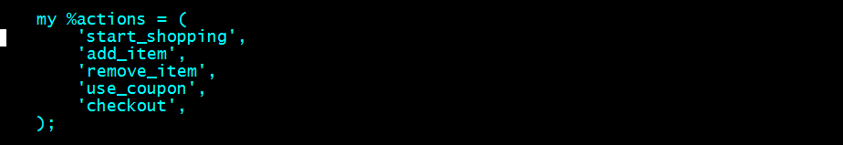

Title: TEMPLATE_TITLE1
Author: David M. Bradford
css: table.css
Base Header Level:  2

The purpose of this article is to talk about my current debugging code and why each piece.

Normal text with some `code`.

```perl
use IO::File;
my $dmb_debug_oh = IO::File->new('/tmp/a.out', '>>');
my $dmbst = 0;
$dmbst++ if (defined $dmb_debug_oh);
my $dmb_debug_file = __FILE__; $dmb_debug_file =~ s?.*/??;
print $dmb_debug_oh localtime . " $dmb_debug_file:" . __LINE__ . ':' . Dumper('WHATEVER') . "\n" if $dmbst;
# CLOSE!!
# $dmb_debug_oh->close if $dmbst;
```


    print "a block of code";
    print "indent with spaces";

   A       | Dang         | Table
  -------- | ------------ | -------------------------------------------
   1       | `formatted`  | whatever
   2       | `code`       | blah blah

This is a link [Nice Text](http://actual.uri.com)

A link to an image:



